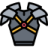

# TP Objetos 2018 PDP - Rol de Lucha y Hechicería

## Entrega 4 - Wollok Game

### Cambios al modelo

Se requiere que todos los personajes no controlados sepan pelear contra cualquier otro personaje, lo que implica "medir fuerzas" en base a su habilidad de lucha. Esto se resuelve de la siguiente manera:

```javascript
	method pelearContra(personaje) {
		const propio = self.habilidadLucha()
		const ajeno = personaje.habilidadLucha()
		const numeroPropio = (100 / (propio + ajeno)) * propio * 1.5
		const numeroAzar = 1.randomUpTo(100)
		return numeroAzar > numeroPropio
	}
```

Además tendremos al wko _sampaoli_, definido de la siguiente manera:

```javascript
object sampaoli inherits PersonajeNoControlado {
	override method pelearContra(personaje) = personaje.habilidadLucha() > 5
}
```

### Tablero de juego inicial

Tendremos un tablero del juego de 25 x 15 celdas, pero el tamaño podría variar. Aconsejamos para ello definir el siguiente objeto visual:

```javascript
import hechiceria.*
import wollok.game.*

object arena {
	method ancho() = 25
	method alto() = 15
	method posicionPersonaje() = game.at(1, 1)
	method posicionRival() = game.at(7, 0)
	method comprar(cosa) = {
		personaje => personaje.comprarArtefacto(cosa)
	}
	method comerciante() = new Comerciante(tipoCobro = new Independiente(10))
}
```

El wko _arena_ nos permitirá parametrizar algunas cuestiones (más abajo las desarrollaremos).

El tablero inicial debe visualizarse de la siguiente manera:


En él aparece

- elDiego, nuestro personaje principal (lo que en Wollok Game se denomina _visual character_)
- un ícono que representan 10 monedas de oro
- una serie de artefactos: espadas, armaduras y máscaras
- nuestro primer rival del Diego, el enigmático dt _sampaoli_

Todas las imágenes pueden obtenerse en el [directorio assets de este repositorio](assets/), cada grupo es libre de modificar las imágenes por otras según lo considere conveniente.

A continuación describiremos el comportamiento esperado dentro del juego.

### Configuración del juego

- el fondo del juego se define por el [archivo soccerWallPaper.jpg](assets/soccerWallPaper.jpg). 
- el título debe decir "Hechiceria" o algo similar
- el tamaño de la pantalla debe ser de 25 x 15 según lo configura el wko _arena_

### Personaje principal: elDiego


El Diego es el personaje principal del juego y como tal tiene caracter visual, pero además se asocia con un personaje (el modelo que construiste en las tres entregas anteriores). Ese modelo comienza con 20 monedas de oro en su haber, no tiene artefactos y la información sobre el hechizo preferido es irrelevante para el juego.

Los movimientos del Diego no necesitan ser programados ya que Wollok Game los provee por ser el personaje principal, pero sí debemos tener en cuenta el siguiente comportamiento:

- la imagen por defecto se obtiene del [archivo maradona.png en assets](assets/maradona.png) si la habilidad de lucha es menor o igual a 5, cuando la sobrepasa obtiene el efecto _wakanda forever_ [representado por el archivo maradona2.png](assets/maradona2.png)

- Cada vez que se presione la tecla I, debe decirnos la cantidad de monedas que tiene, la cantidad de artefactos que posee y su habilidad de lucha


**Nota**: queda fuera de alcance del TP evitar que el Diego se salga del tablero, cuando uno lo hace volver aparece nuevamente (como en la realidad).

### Adquiriendo monedas


Dado que inicialmente el Diego tiene solo 20 monedas, tiene la oportunidad de incrementar sus arcas adquiriendo nuevas monedas que están dispersas por el tablero. La moneda

- tiene como ícono fijo el [archivo bitcoin.png en assets](assets/bitcoin.png)
- la posición en la que se ubica es al azar: el x es un número entre 2 y el ancho de la pantalla - 2, el y es un número entre 2 y el alto de la pantalla (definidos en el wko arena)

Cuando el Diego atrapa una moneda (evento de colisión entre ambos objetos visuales),

- el Diego cumple un objetivo (gana 10 monedas)
- nos informa cuántas monedas tiene ahora
- la moneda se debe reposicionar en el tablero en cualquier nuevo lugar considerando los mismos límites que en la inicialización (entre 2 y el ancho de la pantalla - 2, entre 2 y el alto de la pantalla - 2). **No debe repetir código con la inicialización**.


### Artefactos

  

Deben crearse una barra de herramientas de artefactos "comprables", en nuestro ejemplo creamos seis. Cada uno de estos son **artefactos visuales**, que se asocian a un posible artefacto como modelo.

- la posición que ocupan es x = 0, y = el alto de la pantalla - 5 y a partir del siguiente se resta uno. Por ejemplo, la primera armadura se ubica en la posición (0, 10), la espada en la posición (0, 9), la máscara en la (0, 8) y así sucesivamente

- la imagen asociada depende del artefacto, quizás sea útil inyectarla en el constructor (pasándole como parámetro la imagen que queremos utilizar). Se proveen las siguientes imágenes: [assets/espada.png](assets/espada.png), [assets/armadura2.png](assets/armadura2.png) y [assets/mascara.png](assets/mascara.png)

Cuando alguno de estos artefactos colisione con el Diego, es porque nuestro personaje lo estará queriendo comprar. En ese caso conviene aprovechar el método comprar(cosa) en el wko _arena_, que lo delega en el Diego y sigue estos pasos:

- el Diego, que es un personaje visual, le delega la responsabilidad al personaje "posta" (que sabe comprar un artefacto con las monedas que tiene). 
- si tiene suficientes monedas, nos informa que se lleva dicho artefacto (**tip:** delegar la forma de mostrarse como string a cada arma) y eliminamos del juego al artefacto (ya no estará más disponible)
- si no tiene suficientes monedas, debe volver a la posición (0, 0) e informar el mensaje de error que recibe del modelo. **Tip:** para volver a la posición original del juego (`game.origin()`) hay que eliminar el personaje del juego y volverlo a crear.


> En este método vemos varias cuestiones: 1) que hay una separación entre modelo y vista (mientras la vista se ocupa de la presentación gráfica al usuario, el modelo es el encargado de respetar las reglas del negocio, en nuestro caso que el personaje compre por lo que el artefacto vale si tiene suficientes monedas), 2) que hay un acoplamiento justo entre ambos componentes (de hecho el modelo no conoce a la vista pero participa en la compra de un artefacto), 3) cómo los errores que tira el negocio los atrapa la _vista_

### Rivales, no enemigos

La parte más compleja del Trabajo práctico es el rival, un elemento visual que debe ubicarse 

- x = 0
- y = un valor al azar entre 2 y el ancho de la pantalla - 3

El rival conoce a un personaje rival, que irá cambiando conforme el Diego vaya ganando sus contiendas. El personaje rival es el que define 

- la imagen que se mostrará en el tablero,
- su "gracia" o frase de cabecera cuando le gana a "el Diego"
- y el personaje no controlado con el que trabaja de fondo

Cuando comienza el juego aparece sampaoli en el tablero, y el Diego solo le puede ganar si su habilidad es mayor a cinco (por lo que está obligado a comprar algún artefacto):


El comportamiento del rival cuando colisiona contra el Diego es el siguiente:

- delegamos el resultado de la pelea al rival (un personaje no controlado), que sabe devolver un booleano
- si ganó (el booleano es true), el Diego lanza un estruendoso grito de victoria, y el rival cambia a su siguiente personaje (en este caso, el chila)
- si por el contrario el Diego pierde, el rival "hará su gracia" diciendo la frase de cabecera, y el rival se reposicionará en el mismo x = 0 y un _y_ diferente al actual (para no quedar en _loop_). 

**Debe delegar las responsabilidades a los objetos visuales y a los de negocio**.

**Tip**: se provee una posible implementación para la selección de rivales, falta aun el código del Rival que es un objeto visual importante para el juego.

```javascript
class PersonajeRival {
	var property personaje
	var property gracia
	var property imagen
}

object rivales {
	var actual = 0
	const property lista = [
		new PersonajeRival(personaje = sampaoli, gracia = "No necesito planificación para ganarte", imagen = "sampaoli.png"),
		new PersonajeRival(personaje = new PersonajeNoControlado(dificultad = moderado), gracia = "Tu no has ganado nada!", imagen = "chilavert.png"),
		new PersonajeRival(personaje = new PersonajeNoControlado(dificultad = dificil), gracia = "Eu sou o mais grande do mundo!", imagen = "pele.png")
	]
	
	method rivalActual() = ...
	method siguiente() {
        ...
	}
}
```

